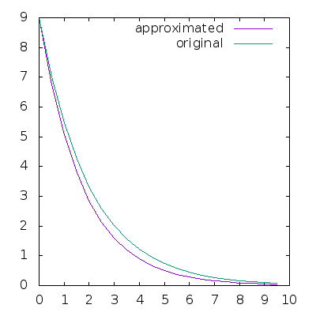

## Solving a differential equation with a 6502
An example how to solve a ordinary differential equation (ODL) on a 6502 with Woz's floating point assembly code.


## Files in the GitHub folder
code.hex: Prepared binary file with all functions which can be loaded into the monitor (load code.hex 0).

wozfp1.txt: Original floating point source code from Woz and Roy with instruction. This functions are used here.

wozfp3.txt: An improved version with a really good introduction how to work with it.

convert.py: Converts the two output files t and u into decimal numbers and print them out with the real solution.


## How and Why?
I'm really into computer history and math. I liked how the whole home computer thing started and the time where people actually coded in assembly. I'm not into games, so if I had one I would try to do lots of math stuff. There are always differential equations in physics which have to be solved with numerical methods.


Fortunately, some floating point routines were already programmed by Roy Rankin and Steve Wozniak (http://www.6502.org/source/floats/wozfp1.txt). I'll use this code and the py65mon monitor (https://github.com/mnaberez/py65) to run it. But it'll work on the VICE emulator too. And on real machines I guess.


## Sketch


The example will be the discharging of a capacitor. I want to know how the voltage is decreasing over the time. Following differential equation is used:

```
ODL:
u(t)' = -1/(RC) * u(t)

START VALUES:
t0 = 0
u(0) = 9V

```

## Solution

The exact solution is easy and known for this equation. Which is good, so I can compare the results at the end. To solve it approximately step by step I'm using the Euler method which leads to:

```
u[n+1] = u[n] + h * ( -1/(RC) * u[n] )
u[n+1] = u[n] -1/(RC) * h * u[n]
with a = -1/(RC)
u[n+1] = u[n] + a * h * u[n]

```

The last formula will be implemented in our program.

## An easy introduction

These are the floating point routines from Steve Wozniak and Roy Rankin in ascii hex format. Copy these in the monitor.

```
fill 3 EA EA 00 00 00 EA 00 00 00 00 00 00 00 00 00 00 00 00 00 00 00 00 00 00 00 00

fill 1D00 A5 09 F0 02 10 01 00 20 1C 1F A5 04 A0 80 84 04 49 80 85 0A A9 00 85 09 20 2C 1F A2 03 B5 04 95 10 B5 08 95 18 BD D1 1D 95 08 CA 10 F0 20 4A 1F A2 03 B5 08 95 14 B5 10 95 08 BD D1 1D 95 04 CA 10 F0 20 50 1F A2 03 B5 14 95 04 CA 10 F9 20 9D 1F A2 03 B5 08 95 14 95 04 CA 10 F7 20 77 1F 20 1C 1F A2 03 BD E1 1D 95 08 CA 10 F8 20 4A 1F A2 03 BD DD 1D 95 04 CA 10 F8 20 9D 1F A2 03 BD D9 1D 95 04 CA 10 F8 20 50 1F A2 03 B5 14 95 04 CA 10 F9 20 77 1F A2 03 BD E5 1D 95 04 CA 10 F8 20 50 1F A2 03 B5 18 95 04 CA 10 F9 20 50 1F A2 03 BD D5 1D 95 04 CA 10 F8 20 77 1F 60 20 00 1D A2 03 BD CD 1D 95 04 CA 10 F8 20 77 1F 60 7E 6F 2D ED 80 5A 02 7A 7F 58 B9 0C 80 52 80 40 81 AB 86 49 80 6A 08 66 7F 40 00 00

fill 1E00 A2 03 BD D8 1E 95 04 CA 10 F8 20 77 1F A2 03 B5 08 95 10 CA 10 F9 20 E8 1F A5 0A 85 1C 38 E9 7C A5 09 E9 00 10 15 18 A5 0A 69 78 A5 09 69 00 10 0B A9 00 A2 03 95 08 CA 10 FB 60 00 20 2C 1F A2 03 B5 10 95 04 CA 10 F9 20 4A 1F A2 03 B5 08 95 10 95 04 CA 10 F7 20 77 1F A2 03 BD DC 1E 95 04 B5 08 95 18 CA 10 F4 20 50 1F A2 03 BD E0 1E 95 04 CA 10 F8 20 9D 1F A2 03 B5 08 95 14 BD E4 1E 95 08 B5 18 95 04 CA 10 F0 20 77 1F 20 1C 1F A2 03 B5 14 95 08 CA 10 F9 20 4A 1F A2 03 BD E8 1E 95 04 CA 10 F8 20 50 1F 20 1C 1F A2 03 B5 10 95 08 CA 10 F9 20 4A 1F A2 03 B5 10 95 04 CA 10 F9 20 9D 1F A2 03 BD E5 1D 95 04 CA 10 F8 20 50 1F 38 A5 1C 65 08 85 08 60 80 5C 55 1E 86 57 6A E1 89 4D 3F 1D 7B 46 FA 70 83 4F A3 03

fill 1F00 18 A2 02 B5 09 75 05 95 09 CA 10 F7 60 06 03 20 12 1F 24 09 10 05 20 8F 1F E6 03 38 A2 04 94 0B B5 07 B4 03 94 07 95 03 CA D0 F3 60 A9 8E 85 08 A9 00 85 0B F0 08 C6 08 06 0B 26 0A 26 09 A5 09 0A 45 09 30 04 A5 08 D0 ED 60 20 8F 1F 20 5D 1F A5 04 C5 08 D0 F7 20 00 1F 50 E3 70 05 90 BD A5 09 0A E6 08 F0 7E A2 FA A9 80 B0 01 0A 56 0F 15 0F 95 0F E8 D0 F2 60 20 0D 1F 65 08 20 CD 1F 18 20 66 1F 90 03 20 00 1F 88 10 F5 46 03 90 AF 38 A2 03 A9 00 F5 08 95 08 CA D0 F7 F0 BC 20 0D 1F E5 08 20 CD 1F 38 A2 02 B5 05 F5 0C 48 CA 10 F8 A2 FD 68 90 02 95 08 E8 D0 F8 26 0B 26 0A 26 09 06 07 26 06 26 05 B0 1C 88 D0 DA F0 BE 86 0B 86 0A 86 09 B0 0D 30 04 68 68 90 B2 49 80 85 08 A0 17 60 10 F7 00 20 5F 1F A5 08 C9 8E D0 F7 60

```

Now we have to put two numbers at location 0x4 and 0x8 (both 4 bytes).

The floating point algorithm requires the binary format, so we have to convert numbers. A description can be found in the original floating point documents.

```
In the Exponent:
00 Represents -128
      ...
7F Represents -1
80 Represents 0
81 Represents +1
      ...
FF Represents +127

Exponent    Two's Complement Mantissa
SEEEEEEE    SM.MMMMMM  MMMMMMMM  MMMMMMMM
    n           n+1       n+2       n+3
```

Example: Lets divide 3 through 0.125

```
3.0:
Integer:    3 = 11
Fraction:   0.0 | 0
Exp:        11.0 * 2^0
            1.10 * 2^1 | Normalization
Converted:  0x81 0b01100000 (0x60) 0x0 0x0

0.125:
Integer:    0 = 0
Fraction:   0.125 * 2 = 0.25 | 0
            0.25  * 2 = 0.5  | 0
            0.5   * 2 = 1.0  | 1
Exp:        0.001 * 2^0
            1.000 * 2^-3
Converted:  0x7D 0b01000000 (0x40) 0x0 0x0
```

Doesn't matter which operation we use (plus, mul or div). The result will always in the second position (0x8). In division the second one (0x8) is the divisor.

So we put the numbers in position with the monitor (radix: hex):

```
fill 4 81 60 0 0 7D 40 0 0
```

A small routine will jump to the floating point code and back (just copy it):

```
assemble 10
jsr fdiv
brk
```

We start the program:

```
goto 10
```

After finishing, it jumps back and reaches a brk (0x0) which gets us back to the monitor.
From there we check the result:

```
mem 8:b
```

Which gives us:

```
84 60 0 0
```

Which means:

```
84 = 2^4
60 = 1.1
1.1 * 2^4 = 11000 = 24 (DEC)
```

It's a little bit funny if you see this kind of stuff the first time. Play with it, you'll figure it out. Attention: If you want to convert negative numbers, you have to use the two's complement (after the normalization).

## Solving the differential equation

It was:

```
u[n+1] = u[n] + a * h * u[n]
with a = -1/(RC)
```

We have to determine the step size h (which represents the time). It should be small, but I want to have an error effect to show you so we choose 0.5 (0.01 would be a much better choice).

```
h = 0.5
a = -1/(20 * 0.1) = -0.5
```

To work with variables we have to initialize them. Here are their positions:

```
t:         0x20 0x21 0x22 0x23
u:         0x24 0x25 0x26 0x27
a:         0x28 0x29 0x2A 0x2B
h:         0x2C 0x2D 0x2E 0x2F
list:      0x30
counter:   0x31
t_list:    0x200
u_list:    0x300
```

t = current time. Which is saved to a list each step

u = current voltage. Which is also saved to a list each step (for plotting later)

a = constant value

h = step size, constant

list = is used as an addition to the initial list location to store the time and voltage values each step

counter = counts steps so I can stop the execution after reaching a chosen value

t_list = start position for time values

x_list = start position for voltage values


Function positions:

```
fadd:       1f50
fmul:       1f77
fdiv:       1f9d
save2list:  40
equation:   80
main:       110
```

fadd = floating point function for adding

fmul = floating point function for multiplication

fdiv = floating point function for division

save2list = save current time and voltage to lists

equation = calculates one step

main = start of the program


Set up (initial) values with the monitor:

```
fill 20 80  0  0  0 
fill 24 83 48  0  0
fill 28 7F C0  0  0
fill 2C 7F 40  0  0
fill 30  0
fill 31  0
fill 32  0
```
Function save2list which saves current time and voltage to list positions.

```
assemble 40
ldx 30
lda $20
sta 200,x
lda $24
sta 300,x
inx
lda $21
sta 200,x
lda $25
sta 300,x
inx
lda $22
sta 200,x
lda $26
sta 300,x
inx
lda $23
sta 200,x
lda $27
sta 300,x
inx
stx 30
rts
```

Creating the equation function. Each time the function gets called, one step will be calculated.

You can copy this routine in the monitor too. The comments will give a warning cause it can't be converted.

u[n+1] = u[n] + a * h * u[n]
```

assemble 80
;
jsr $40
;
;              a
lda $28
sta $4
lda $29
sta $5
lda $2a
sta $6
lda $2b
sta $7
;              h
lda $2c
sta $8
lda $2d
sta $9
lda $2e
sta $a
lda $2f
sta $b
;              a*h
jsr $1f77
;
;u_n
lda $24
sta $4
lda $25
sta $5
lda $26
sta $6
lda $27
sta $7
;
;                 u_n*(a*h)
jsr $1f77
;
;                 u_n
lda $24
sta $4
lda $25
sta $5
lda $26
sta $6
lda $27
sta $7
;
;                u_n + (h*a*u_n)
jsr $1f50
;
;                u = u_n+1
lda $8
sta $24
lda $9
sta $25
lda $a
sta $26
lda $b
sta $27
;
;               h
lda $2c
sta $8
lda $2d
sta $9
lda $2e
sta $a
lda $2f
sta $b
;
;               t
lda $20
sta $4
lda $21
sta $5
lda $22
sta $6
lda $23
sta $7
;
;               t+h
jsr $1f50
;
;               t = t+h
lda $8
sta $20
lda $9
sta $21
lda $a
sta $22
lda $b
sta $23
;
rts

```


Creating the main function which calls the equation function several times.

```
assemble 110
ldx $31
cpx #$14
beq $121
jsr $80
ldx $31
inx
stx $31
jmp $110
brk
```
cpx #$14 mean we calling the function for 20 times. We start it with

```
goto 110
```

And check the cycles after the calculation

```
cycles
217824
```
Which mean it would have taken 0.2 seconds on a 1 MHz processor. Pretty fast in my opinion. The emulator took longer on my (weak) notebook.

Problem: We can't see the result. That's the problem with converted numbers. We can't read it. I'm cheating now and writing a small Python program to convert it.

Before that, lets save the results in another file

```
save t 200 24F
save u 300 34F
```

Executing the Python script convert.py prints out:

```
0.0 9.0 9.0
0.5 6.75 7.009
1.0 5.062 5.459
1.5 3.797 4.251
2.0 2.848 3.311
2.5 2.136 2.579
3.0 1.602 2.008
3.5 1.201 1.564
4.0 0.901 1.218
4.5 0.676 0.949
5.0 0.507 0.739
5.5 0.38 0.575
6.0 0.285 0.448
6.5 0.214 0.349
7.0 0.16 0.272
7.5 0.12 0.212
8.0 0.09 0.165
8.5 0.068 0.128
9.0 0.051 0.1
9.5 0.038 0.078
```

The third column is the real value. With the help of GnuPlot:



